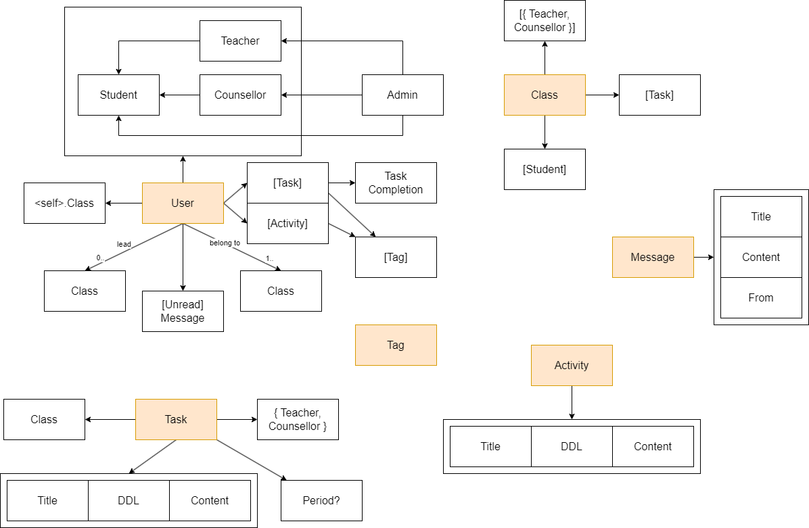

# 接口对接

1. 对于activity的改变参与活动状态的接口，对于id的界定需要修改
   1. 是用户的id还是activity的id
   2. 目前：这个API是不是有问题，无法标记到activity，在后端id改为了activity的id，默认当前user进退
2. 

# 项目简介

## 后端介绍

数据库大作业 BUAA_Calendar 项目的后端

采用 Django 作为项目框架， python版本选用了`python3.10`

## 启动方式

```shell
# 安装相关依赖
conda create --name buaa_calendar python=3.10
pip install -r requirements.txt

# 进入项目目录
cd Calendar
# 启动后端
python manage.py runserver
```

## 管理员账户

账号：root

邮箱：db@buaa.edu.cn

密码：123456

访问管理网站：http://127.0.0.1:8000/admin/

# 项目结构



## 实体

共计6个实体：
- 用户User
- 任务Task
- 班级Class
- 标签Tag
- 消息Message
- 活动Activity

## API 规范

见：https://apifox.com/apidoc/shared-f18b70f2-bf84-4766-aa28-9a466ddd0c11

## 接口

目前为在用户视角的接口

### 用户（所有）

- 登录
- 查看个人信息
- 修改个人信息
- 请求任务、请求活动

### 用户（学生）

- 查询：

  ```py
  { <class-id>: { <task-id>: {"": ""}}}
  ```

- 查询公共活动

- 选择参与活动

- 退出某项活动

- 调整任务完成度

- 设置任务提醒

- 接受消息：

  ```python
  {
      <message-id>: {
          "titile": <str>,
          "from": <str>,
          "time": <int>,
          "content": <str>,
          "unread": <bool>
      }
  }
  ```

- 阅读消息

- 查询所有tag列表

- 修改tag和任务的绑定关系

- 修改tag和活动的绑定关系

### 用户（老师）

- 查询管理的班级，包括任务
- 向班级发放任务
- 修改针对班级发放的任务
- 向学生发放任务
- 向班级广播消息
- 向学生发送消息
- 管理班级（将学生添加至班级）
- 管理班级（将学生从班级删除）

### 管理员

- 创建班级
- 给班级添加老师
- 从班级删除老师
- 给班级添加学生
- 从班级删除学生
- 发放集体任务
- 广播消息
- 创建活动
- 修改活动
- 重置用户密码
